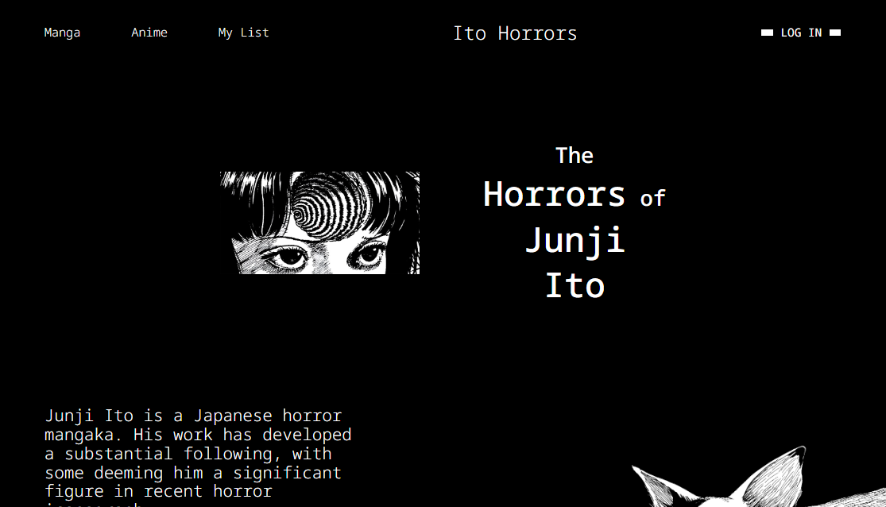
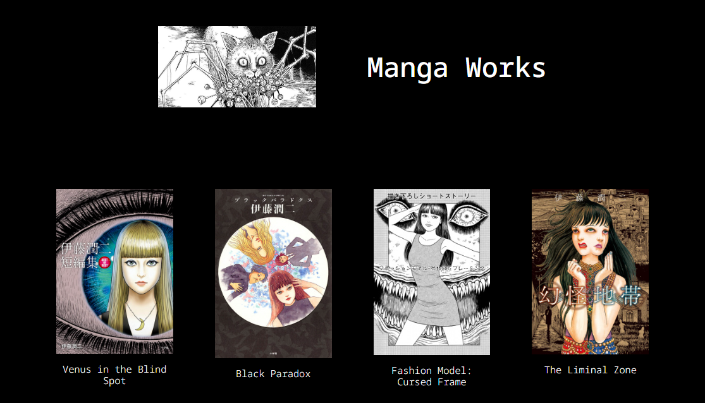
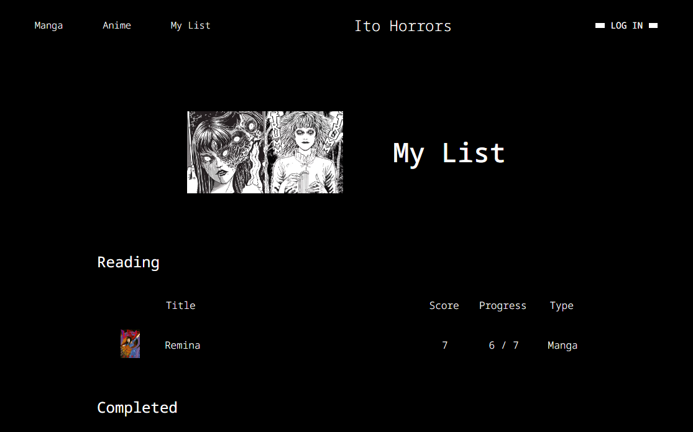
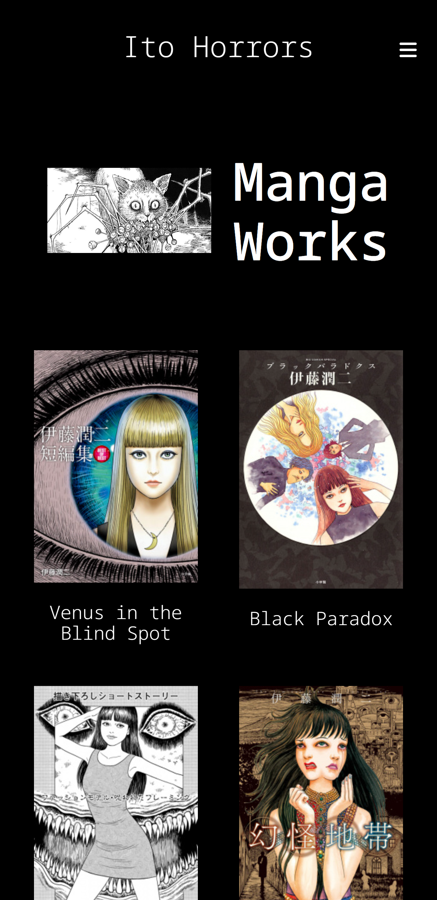

  
  <h1>Ito Horrors: Artist Website</h1>

  

    Artist website showcasing Junji Ito's horror works with a reading list feature
  

  

    
    
    
  

  <h4>
    <a href="https://ito.danxschz.com/">View Demo</a>
     · 
    <a href="https://github.com/danxschz/manga-app/issues/">Report Bug</a>
  </h4>

 

## About the Project

### Screenshots

  <h3>Desktop</h3>
  
  
  &nbsp;
  
  

  &nbsp;

  

  <h3>Mobile</h3>
  

  &nbsp;

  

### Built With

- React
- React Router
- TypeScript
- HTML
- CSS Modules
- Sass
- Webpack
- npm

### Color Reference

| Color       | Hex     |
| :--------:  | :-----: |
| Neutral 100 | #FFFFFF |
| Neutral 700 | #191919 |
| Neutral 900 | #000000 |

## Usage

- Browse through Junji Ito's horror manga and anime works.
- Manage your personal reading / watch list where you can set score, status and progress for any title.

## Contact

Daniel Sanchez (@danxschz) · [Portfolio](https://danxschz.com/) · contact@danxschz.com